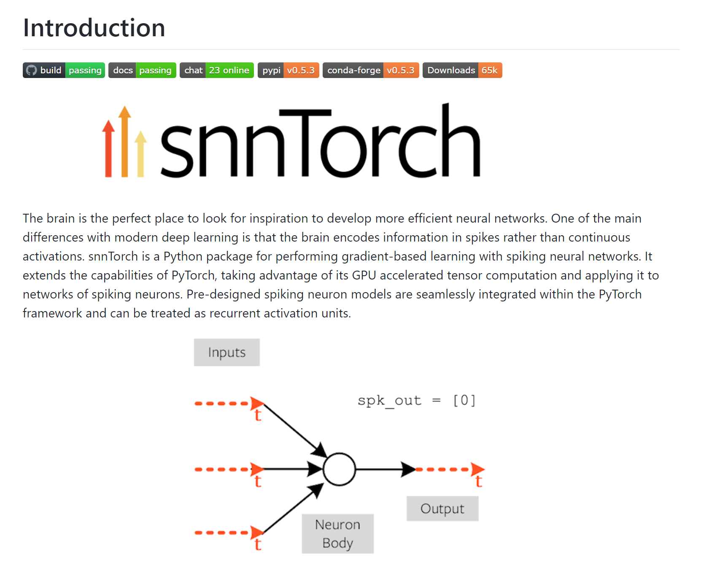
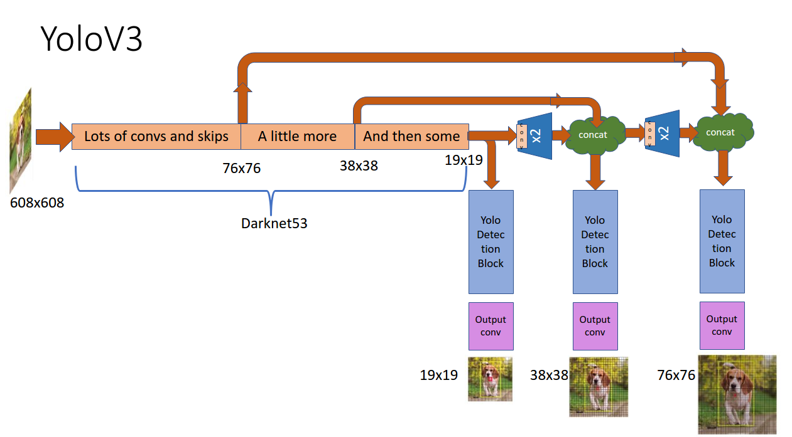
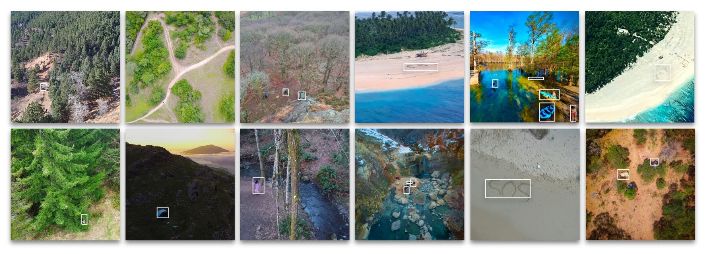

# SOS.net: Computer Vision for Drone Search and Rescue
**Motivation**:
The National Park Service’s missing person reports often include case-specific visual cues (like hammocks, inflatable kayaks, or bright gear) that search and rescue teams rely on. Current drone-based systems often miss these individualized or general distress signals. Enhancing drone vision with intelligent, parameterized search capabilities, tuned to each report, could make missions more targeted and effective. 

*How can drone-based SAR be automated and optimized to detect both personalized identifiers and general distress signals, without sacrificing power efficiency, processing speed, or accuracy?*

## SOS.net (v2): Spiking Neural Network 
Neuromorphic computing, particularly Spiking Neural Networks (SNNs), offers a compelling solution. These models are well-suited for deployment on lightweight drone hardware (event-driven processing, low latency, spike-based activation, local short-term memory at the neuron/network level), enabling intelligent, energy-efficient inference in real time, rather than after-the-fact video stream processing.

SOS.net (v2) adapts the YOLOv3 object detection model for use with SNNs, using [snnTorch](https://snntorch.readthedocs.io/en/latest/).
<p align="center">
  
</p>

[YOLOv3](https://github.com/ultralytics/yolov3) is a fast, single-stage object detection model that combines feature extraction and object localization into a unified framework. This architecture enables high-speed inference, and performance can be tuned by adjusting the model size, without retraining.

<p align="center">
  
</p>

My implementation uses a PyTorch-based version of YOLOv3 modified for spiking computation. This required converting the PASCAL VOC dataset to COCO format and replacing the model's activation functions with biologically-inspired spiking dynamics.

**Key Features:**
- Replaces all ReLU activations in YOLOv3 with Leaky Integrate-and-Fire (LIF) neurons.
- Uses surrogate gradients to enable backpropagation through spiking neurons.
- Supports standard YOLOv3 training pipeline with minimal changes.

**Architecture Changes:**
- Wraps YOLOv3 convolutional layers (`Conv`) with `SNNConv`, which injects an LIF neuron layer after the convolution.
- Preserves original YOLO training API and utilities (e.g., `train.py`, dataloaders, hyperparameters).

```
$ python snn_yolo_train.py \
    --weights yolov3.pt \
    --data data/coco.yaml \
    --epochs 3 \
    --batch-size 16 \
    --imgsz 416 \
    --device 0
```
## SOS.net (v1): Deep Neural Network
SOS.net (v1) is based on the Keras implementation of RetinaNet object detection as described in [Focal Loss for Dense Object Detection](https://arxiv.org/abs/1708.02002) by Lin et al. This version is runnable only on footage the drone camera has already captured — NOT the drone hardware itself (in real-time). The `keras-retinanet` repository provides all the necessary tools to train models on drone images for downstream Search and Rescue (SAR) applications.

## Instructions

### Development Tools
* Visual Studio Code (supports SSH access to Linux from Windows or Mac)
* LabelImg for image annotation: http://tzutalin.github.io/labelImg/
* Windows PowerToy for renaming and resizing images

### Installation (Linux Only)
0) Install Python 3.6
1) Create a project folder called sos
2) Create a Python virtual environment and install TensorFlow 2.4
3) Clone this repository
4) In the repository, execute `pip install .`
5) Alternatively, you can run the code directly from the cloned repository, but you need to compile the Cython code first:
```
python setup.py build_ext --inplace
```

### Dataset Preparation
1. Download images from your drone (e.g., connect DJI Mini 2 directly to your laptop).
2. Use PowerToy Rename tool to rename image files consistently.
3. Open LabelImg, select your image folder.
4. Set annotation format to PascalVOC (left button).
5. Annotate images by drawing bounding boxes.
6. Create the following folder structure to train:

```
sosVOS/
      Annotations/               #Annotated xml files of all images (training, validation and testing)
      JPEGImages/                #all images (jpg or png)
      ImageSets/
               Main/
                   test.txt      #Names of test images only. (add new line at end)
                   train.txt     #Names of training images only (70%?). (add new line at end)
                   trainval.txt  #names of all images (remove extension)
                   val.txt       #names of validation images only
```

### Initial Setup
Run this once. When you log back in, just activate the environment (see below).
```
# Navigate to home directory
mkdir -p /home/sos.net/
cd /home/sos.net/

# Create virtual environment
python3 -m venv --copies sosenv

# Activate environment
source sosenv/bin/activate

# Upgrade pip
pip install --upgrade pip

# Install TensorFlow 2.3.0
pip install tensorflow==2.3.0

# Install other dependencies including this package
pip install .
python setup.py build_ext --inplace

# Install Keras 2.4 (required)
pip install keras==2.4.1

# All set!
```
Whenever you log back into your system, activate your environment by running: `source ~/sosenv/bin/activate`

### Training
Update the class list if needed in keras_retinanet/preprocessing/pascal_voc.py:
```
voc_classes = {
    'person'      : 0,
    'flag'        : 1,
    'SOS'         : 2,
    'dog'         : 3,
    'backpack'    : 4,
    'jacket'      : 5,
    'horse'       : 6
}
```
Download the latest training snapshot from this [link](https://drive.google.com/file/d/111cTgEaHRkhjURit0uHgVy-WWO8x1KxG/view?usp=sharing). Run training commands (adjust `--steps` according to your training set size):
```
# Train from scratch
python keras_retinanet/bin/train.py --batch-size 1 --snapshot-path snapshots --random-transform --steps 45 pascal /home/tf23/sosVOC

# Fine-tune on pre-trained model
python keras_retinanet/bin/train.py --batch-size 1 --snapshot model/resnet50_pascal_29.h5 --snapshot-path snapshots --random-transform --steps 45 pascal /home/tf23/sosVOC
```

### Inference
After training, convert checkpoint to inference model:
```
python keras_retinanet/bin/convert_model.py snapshots/resnet50_pascal_29.h5 models/resnet50_pascal_all.h5
```
Edit infer.py with your paths:
```
model_path = '../../models/resnet50_pascal_all.h5'
image_path = '../../images/sos4.jpg'
image_output_path = '../../images/sos4_detected.jpg'
```
Run the inference:
```
python infer.py
```
## Sample Predictions
<p align="center">
  
</p>
